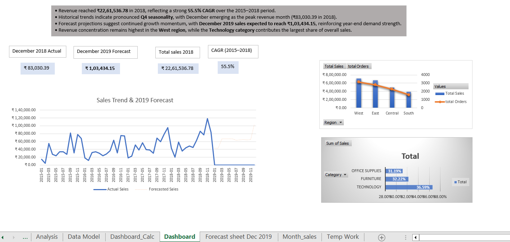

# 📊 Sales Performance & Forecast Dashboard (Excel)

## 📌 Project Overview

This project presents a comprehensive sales performance analysis and time-series forecasting dashboard built in Microsoft Excel.  
The analysis evaluates historical sales data from 2015–2018 and projects 2019 revenue using Exponential Smoothing to capture growth trends and seasonal demand patterns.

The dashboard is designed for executive-level reporting and strategic decision-making.

---

## 🖼 Dashboard Preview

---

## 📈 Key Business Insights

- Revenue reached **₹22,61,536.78 in 2018**, reflecting a strong **55.5% CAGR** over the 2015–2018 period.
- Sales exhibit consistent **Q4 seasonality**, with December emerging as the peak revenue month (₹83,030.39 in 2018).
- Forecast projections indicate continued growth momentum, with **December 2019 expected to reach ₹1,03,434.15**.
- The **West region** contributes the highest share of revenue.
- The **Technology category** drives the largest portion of total sales.

---

## 📊 Dashboard Features

- KPI Cards (Total Sales, CAGR, December Performance, Forecast)
- Historical Sales Trend Analysis (2015–2018)
- 2019 Revenue Forecast Visualization
- Region-wise Sales Breakdown
- Category Contribution Analysis

---

## 🔮 Forecasting Methodology

The forecast was generated using Excel’s built-in **Exponential Smoothing** model with automatic seasonality detection.  
This approach captures:

- Long-term growth trend
- Recurring monthly seasonal patterns
- Year-end demand spikes (Q4 concentration)

The model provides directional revenue projections to support planning and budgeting decisions.

---

## 🛠 Tools & Techniques Used

- Microsoft Excel
- Exponential Smoothing Forecasting
- Pivot Tables & Aggregations
- CAGR Calculation
- KPI Card Design
- Executive Dashboard Layout
- Data Cleaning & Structuring

---

## 📂 Repository Structure

Sales-Forecasting-Excel-Dashboard  
│  
├── data/  
│   └── dataset.csv  
│  
├── dashboard/  
│   └── Sales_Forecast_Dashboard.xlsx  
│  
├── images/  
│   └── dashboard_preview.png  
│  
└── README.md  

---

## 🎯 Business Objective

To analyze historical sales performance, identify seasonal demand trends, and generate forward-looking revenue forecasts that assist leadership in strategic planning and performance monitoring.

---

## 👤 Author

**Gautam Gupta**  
Aspiring Data Analyst  
Skills: Excel | SQL | Power BI | Data Visualization
